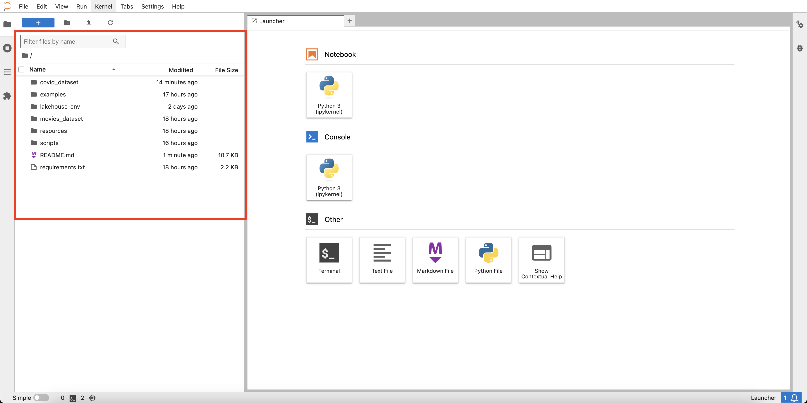

# Lakehouse in action

Welcome to _Lakehouse in action_ ! The objective of this hands-on session is:

- Showcase the lakehouse architecture with concrete examples;
- Show how Spark can be used to manipulate and transform data;
- Present Delta capabilities for enhancing data management in lakehouse environments. 

## Installing required softwares

### Java 17

#### Mac OS

- [Oracle • JDK Installation Guide](https://docs.oracle.com/en/java/javase/17/install/installation-jdk-macos.html)

Alternetively, you can install using [HomeBrew](https://brew.sh):

```shell
brew install openjdk@17
sudo ln -sfn /usr/local/opt/openjdk@17/libexec/openjdk.jdk /Library/Java/JavaVirtualMachines/openjdk-17.jdk
echo 'export PATH="/usr/local/opt/openjdk@17/bin:$PATH"' >> ~/.zshrc
java --version
```

#### Linux (Ubuntu/Debian)

- [Oracle • JDK Installation Guide](https://docs.oracle.com/en/java/javase/17/install/installation-jdk-linux-platforms.html)

Alternetively, you can install using `apt`:

```shell
sudo apt update
sudo apt install openjdk-17-jdk
java --version
```

#### Windows

- [Oracle • JDK Installation Guide](https://docs.oracle.com/en/java/javase/17/install/installation-jdk-microsoft-windows-platforms.html)

### Python 3

#### Mac OS

- [Official Python download page](https://www.python.org/downloads/)

Alternetively, you can install using [HomeBrew](https://brew.sh):

```shell
brew install python3
python3 --version
pip3 --version
```

#### Linux (Ubuntu/Debian)

- [Official Python download page](https://www.python.org/downloads/)

Alternetively, you can install using `apt`:

```shell
sudo apt update
sudo apt install python3
python3 --version
pip3 --version
```

#### Windows

- [Official Python download page](https://www.python.org/downloads/)

## Exercises

After installing all the necessary dependencies, you are now ready to do the exercises.

It's recommended that you clone this repository and execute the commands below from the root of the cloned repo folder. That way, you have access directly to the exercise Jupyter notebook. Otherwise, if you prefer using a different folder, simply copy the necessary resources/files from the repository and place them in your folder.

Let's start by creating a virtual environment to isolate your project's dependencies from your global Python installation:

```shell
python3 -m venv lakehouse-env
```

To activate the environment:

```shell
source lakehouse-env/bin/activate
```

With the environemnt in place, let's install Jupyter Lab/Notebook:

```shell
pip3 install jupyter
```

Next, install PySpark by running:

```shell
pip3 install pyspark==3.5.3
```

To verify the installation:

```shell
pyspark --version
```

#### Install other Python libraries

Finally, we are going to install the following libraries:

- Delta Sharing
- Pandas
- MatPlotLib
- PyJWT
- Cryptography
- seaborn

To install, run:

```shell
pip3 install delta-sharing pandas matplotlib pyjwt cryptography seaborn
```

Start Jupyter by running the following command:

```shell
jupyter lab
```
You should be redirected to the Jupyter UI. In the left side, you should see a file system explorer interface, as seen below:

 :

### Exercise #1 - COVID Dataset

If you chose the cloned repo as the root folder, simply open the folder `covid_dataset` in the Jupyter file explorer, and click on `covid_exercise.ipynb`. Then, simply follow the instructions to complete the exercise.

Otherwise, you should copy the file [covid_dataset/covid_exercise.ipynb](./covid_dataset/covid_exercise.ipynb) to your preferred folder and follow the exercise normally.

In this exercise, we'll manipulate the COVID 19 dataset contained in a Data Lake to showcase how the lakehouse architecture, together with Spark and Delta, can be used to obtain insights from unstructured data. 

### Exercise #2 - Movies Dataset

If you chose the cloned repo as the root folder, simply open the folder `movies_dataset` in the Jupyter file explorer, and click on `movies_exercise.ipynb`. Then, simply follow the instructions to complete the exercise.

Otherwise, you should copy the file [movies_dataset/movies_exercise.ipynb](./movies_dataset/movies_exercise.ipynb) to your preferred folder and follow the exercise normally.

In this exercise, we'll manipulate a local dataset about movie ratings to highlight how Spark can be useful for data manipulation, and how we can get insights using data visualization libraries in Python.

You can download the two files representing our dataset with the following link:

- [movies.csv](https://1drv.ms/x/c/f3946abff5ef9858/EXbV9hxa7nNHqCy1tjTNKIcBOlsB3UddA5Ru-AEj1HbuNA?e=yEtQmA): CSV file with movie information.
- [ratings.csv](https://1drv.ms/x/c/f3946abff5ef9858/EcVdyGaO1DpFrsCmofhhlIgB-UaOLxGqqQU2fIJ2d_yowQ?e=frJpLC): CSV file containing ratings about movies, from 1995 to 2015.

Download these files and place them in `movies_dataset/`, or in the same folder where `movies_exercise.ipynb` is located. 

## Extra: Spark and Delta crash course

If you finished your exercise, you can check this section for understanding the integration beteween Delta and Spark.

To use PySpark on your notebook, first of all you need to create a Spark Session.

The following snippet creates a Spark session, a very simple DataFrame and displays the DataFrame content.

```python
from pyspark.sql import SparkSession

spark = SparkSession.builder \
    .appName("MySampleApp") \
    .getOrCreate()

data = [("Alice", 29), ("Bob", 31), ("Cathy", 22)]
columns = ["Name", "Age"]

df = spark.createDataFrame(data, columns)
df.show()
```

> Note: the first time you run this code, it will probably take some time for Spark to initialize.

### Integrating with Delta Lake

Now, let's integrate your Spark application with the Delta Lake libraries.

- [Delta Lake • Quick Start](https://docs.delta.io/latest/quick-start.html#set-up-apache-spark-with-delta-lake)

To leverage Delta Lake, you need to configure your Spark session to:

1. Load the Delta Lake Java/Scala libraries during Spark initialization
2. Use the Delta Spark catalog and Session extension

```python
from pyspark.sql import SparkSession

spark = SparkSession.builder \
    .appName("Getting started with Spark and Delta Lake") \
    .config("spark.jars.packages", "io.delta:delta-spark_2.12:3.2.0") \
    .config("spark.sql.extensions", "io.delta.sql.DeltaSparkSessionExtension") \
    .config("spark.sql.catalog.spark_catalog", "org.apache.spark.sql.delta.catalog.DeltaCatalog") \
    .getOrCreate()
```

After the Spark session is created, you can generate a dummy Spark DataFrame and write it as a Delta table:

```python
deltaTablePath = "resources/tmp/sample-delta-table"

data = spark.range(0, 5)
data.write.format("delta").save(deltaTablePath)
```

Finally, you can read the Delta table created above to a Spark DataFrame and print its content.

```python
df = spark.read.format("delta").load(deltaTablePath)
df.show()
```

### Integrating with SAP HANA Cloud, Data Lake Files

In the above example, the Delta table was written to your local file system (your disk).
In this step, we are going to configure Spark to use [SAP HANA Cloud, Data Lake Files](https://help.sap.com/docs/hana-cloud-data-lake) (aka. HDL Files/HDLF) as the storage for your data.

First of all, you need to have an HDLF FileContainer where your data will be stored.
The authentication between your Spark application and your FileContainer is based on x509 certificates that are configured as trusted/authorized to access the data.

An HDLF FileContainer was previously prepared for this workshop session.
The URL to access it is the following:

**TODO** Adjust the CFC URL.

```
hdlfs://cfcselfsigned1.files.hdl.demo-hc-3-hdl-hc-dev.dev-aws.hanacloud.ondemand.com
```

You can obtain the certificates to authenticate against this FileContainer accessing the following link:

**TODO** Link to download the certs.

The Spark session should be configured as follows. Replace the `<path-to-certs>` placeholder with the path where you downloaded the certificates.

```python
from pyspark.sql import SparkSession

spark = SparkSession.builder \
    .appName("Getting started with Spark, Delta Lake and HDL Files") \
    .config("spark.jars.packages", "io.delta:delta-spark_2.12:3.2.0,com.sap.hana.datalake.files:sap-hdlfs:3.0.27") \
    .config("spark.sql.extensions", "io.delta.sql.DeltaSparkSessionExtension") \
    .config("spark.sql.catalog.spark_catalog", "org.apache.spark.sql.delta.catalog.DeltaCatalog") \
    .config("spark.hadoop.fs.AbstractFileSystem.hdlfs.impl", "com.sap.hana.datalake.files.Hdlfs") \
    .config("spark.hadoop.fs.hdlfs.impl", "com.sap.hana.datalake.files.HdlfsFileSystem") \
    .config("spark.hadoop.fs.defaultFS", "<hdlfs-endpoint-url>") \
    .config("spark.hadoop.fs.hdlfs.ssl.certfile", "<path-to-certs>/client.crt") \
    .config("spark.hadoop.fs.hdlfs.ssl.keyfile", "<path-to-certs>/client.key") \
    .getOrCreate()
```

To validate the configuration, you can write a Delta table using the same commands that were used in the [Integrating with Delta Lake](#integrating-with-delta-lake) section, but now, the data will be stored on the object store.

> NOTE: Considering that the same FileContainer is being shared between all the workshop participants, **please isolate your data by providing a unique prefix when specifying the path where your Delta table will be written**.

```python
deltaTablePath = "/<my-full-name>/sample-delta-table"

data = spark.range(0, 5)
data.write.format("delta").save(deltaTablePath)

df = spark.read.format("delta").load(deltaTablePath)
df.show()
```

Execution may take longer this time since the data is being stored remotely.
Latency tends to be high since FileContainer is deployed in a data center in Europe.

### Transforming data using Spark

**TODO** Instructions to process the COVID dataset and store the result in Delta table(s).

## Sharing data using Delta Sharing

After processing the data, you may want to share the outcome with external users/systems.
For that, you can leverage [Delta Sharing](https://delta.io/sharing/), which is an open source protocol that enables data to be securely shared with authorized recipients.

To share Delta tables stored in HDL Files, you need to:

1. Register a Share in the HDLF Catalog.
2. Create a Share Table in the HDLF Catalog that points to the Delta table location in your FileContainer.
3. Generate a JWT that gives access to the Share.
4. Provide your authorized recipeint with this JWT (through a secure channel).

HDL Files offers a Catalog API that can be used to manage your shares and share tables.
For simplicity, you can use the script [share-delta-table.py](./scripts/share-delta-table.py) to cover steps 1 and 2.

> NOTE: Choose a unique name for your share, to avoid conflict with other participants of the workshop.

```shell
python3 scripts/share-delta-table.py \
    --hdlfEndpoint <hdlf-endpoint> \
    --clientCertPath <path-to-certs>/client.crt \
    --clientKeyPath <path-to-certs>/client.key \
    --shareName <my-unique-share-name> \
    --shareSchema <schema-name> \
    --shareTableName <table-name> \
    --deltaTableLocation <path-to-delta-table>
```

After the Share and Share table(s) are created, you can generate a JWT with enough permissions to access the data in the share.
The script [generate-delta-sharing-profile.py](./scripts/generate-delta-sharing-profile.py) generates the HDLF JWT, authorizing the only the share(s) you want, and generates a Delta sharing profile file that can be shared with the recipient you want to provide access to.

```shell
python3 scripts/generate-delta-sharing-profile.py \
    --hdlfEndpoint <hdlf-endpoint> \
    --clientCertPath <path-to-certs>/client.crt \
    --clientKeyPath <path-to-certs>/client.key \
    --authorizedShares <my-share-name> \
    --outputFilePath <delta-sharing-profile-output-path>
```

## Consuming data using Delta Sharing

In possession of a Delta Sharing profile, you can use the any Delta Sharing client to consume the data that was shared with you.
Here, we are going to use the [Python Delta Sharing client](https://github.com/delta-io/delta-sharing?tab=readme-ov-file#python-connector).

Start by instantiating the client and pointing to the profile file:

```python
import delta_sharing

profileFile = "/path/to/delta-sharing-profile.json"
client = delta_sharing.SharingClient(profileFile)
```

You can list all shares and tables that were shared with you:

```python
allShares = client.list_shares()
allTables = client.list_all_tables()

print(allShares)
print(allTables)
```

And load one of the tables as a Pandas DataFrame:

```python
aTable = allTables[0]

df = delta_sharing.load_as_pandas(f"{profileFile}#{aTable.share}.{aTable.schema}.{aTable.name}")
print(df)
```

From now, you can query, show, transform, plot the DataFrame as any other regular Pandas DataFrame.
See an example of how to plot the data using MatPlotLib:

```python
import matplotlib.pyplot as plt

df.plot()
plt.show()
```
